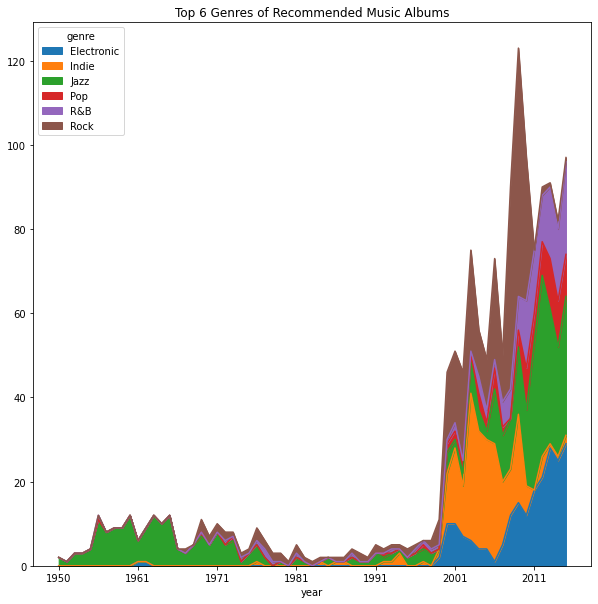
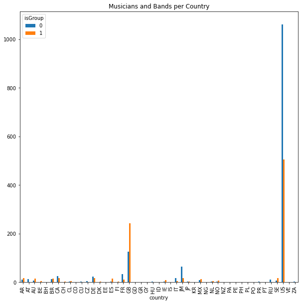
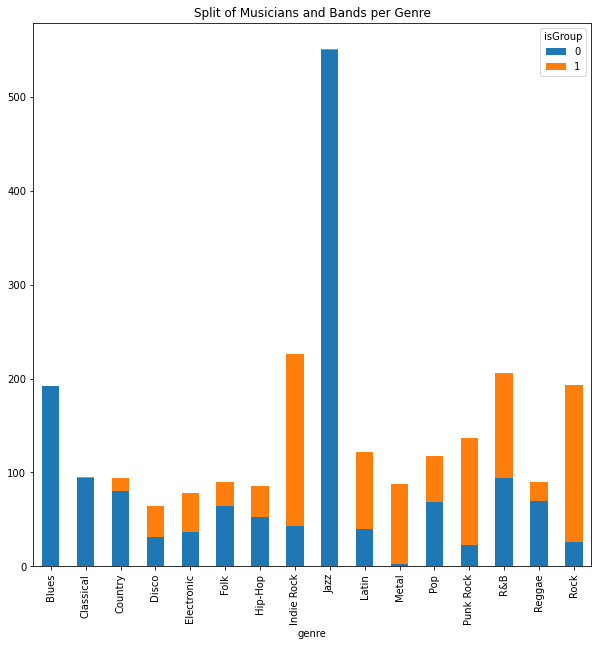
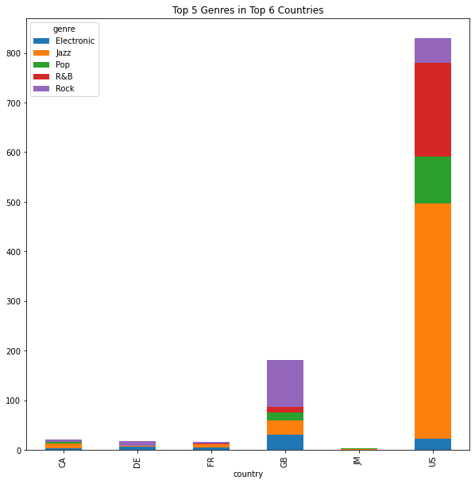
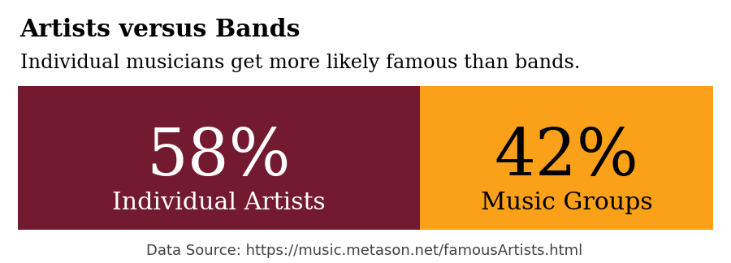

# Information Visualization of Music Data

By Philipp Ackermann, philipp.ackermann@zhaw.ch, ZHAW School of Engineering

Zurich, January 2022

---

## Introduction

The purpose of this lab work is to practice data visualization, and hopefully gain some best-practices along the way.

The goal is to get insights from data on musicians, bands, albums, and the US music recording industry.

---
***DISCLAIMER***

The data provided for this lab work is collected and prepared by the author and is definitevely biased:

- by the data available at the time of acquiring it
- by the data that was available for free (Open Data)
- by personal music style preferrences

Any message deduced from this data does therefore not reflect universal facts but are only valid for the scope of the current data.

---

## Data Sources

The data on musicians, bands, and albums is sourced from the music database operated by Metason for their ArtistInfo application. Metason ([www.metason.net](https://www.metason.net)) is run by the author as a private project.

ArtistInfo is available as App for iOS and macOS as well as a Web front-end at [music.metason.net](https://music.metason.net). The data for albums and artists is accessible via Web (see URLs below). More details on individual data records can be accesssed via the corresponding `ìd` or via Universal URL.

### Artists

- Famous musicians and bands
  - Data: [data/famousArtists.json](data/famousArtists.json)
  - Web: https://music.metason.net/famousArtists.html
- Data was collected in 2019 by Web crawling of
  - top100 lists of music community Web sites
- More details on Atists is available via
  - Universal URL: https://music.metason.net/artistinfo?name=`artist name`
  - Sample URL: [https://music.metason.net/artistinfo?name=Radiohead](https://music.metason.net/artistinfo?name=Radiohead)

### Albums

- Recommended albums
  - Data: [data/recomAlbums.json](data/recomAlbums.json)
  - Web: https://music.metason.net/greatRecords.html
- Data was collected in 2019 by Web crawling of
  - best-of lists from music community Web sites
  - top ratings of e-commerce Web sites selling music (e.g., Amazon)
- More details on Albums is available via
  - Universal URL: https://music.metason.net/artistinfo?name=`artist name`&title=`album title`
  - Sample URL: [https://music.metason.net/artistinfo?name=Radiohead&title=Man%20Of%20War](https://music.metason.net/artistinfo?name=Radiohead&title=Man%20Of%20War)

### US Music Industry Revenues

Sales data from the Recording Industry Association of America (RIAA).

- 70 years of sales by media, from vinyl to streaming
- Data from 1973-2020: [data/USMusicMarket.csv](data/USMusicMarket.csv)
- Source: https://www.riaa.com/u-s-sales-database/
- Revenue values are in Millions USD (adjusted for inflation)
- Data from 1950-1972 are estimated from different sources

---

## Info Vis Process

Crreating convincing Info Vis is typically an iterative process:

1. Data Processing
   - Data Acquisition and Extraction
   - Data Transformation and Cleansing
2. Information Modeling
   - Data Analysis
   - Visual Data Mining by creating data graphics
   - Back to step 1 to improve insights into data
3. Presentation Authoring
   - Story creation: open questions, interesting insights, messages, ...
   - Layout: chart type(s), dimensions, data mappings, ...
   - Styling: color palletes, typography
   - Text messages: title, subtitle, captions, annotations, highlights
   - Interactions & animations (optional, not for this lab work)
4. Back to step 1 or 2 to improve information visualization
  

*Figure 1: The Process Workflow for Information Visualization*

The good news:

- Data Processing for the music data in this repository is already done for you
- Content is already unified according to classifications for
  - Musical genres & styles: https://music.metason.net/genres.html
  - Music instruments: https://music.metason.net/instruments.html - World regions & countries: https://music.metason.net/regions.html
- Data Analytics is prepared
  - Using __pandas__ for data mangling and simple data graphics
  - For all data sources there are templates available
  - Python code: `analytics/*Analytics.py`
  - See sample data graphics below
- Data Enhancing is examplified
  - Python code: `analytics/*Enhancing.py`
- Information Visualization has a few samples
  - Using __matplotlib__ for creating convincing info vis
  - Python code: `infovis/*.py`
  - See sample info vis below

---

## Sample Data Graphics used for Data Analytics

Visual Data Mining is a critical component in exploratory data analysis. You quickly create plots in order to better understand your data. These data graphics do not have to be perfect. We therefore use the plot functionality that pandas is providing. These charts do not look great but are easy to generate due to some automatisms (data mapping, dealing with missing values, ...)

### Album Data

---

---

---

### Artist Data

---

---

---

---

---

---

---

---

---

## Interesting Questions and Potential Insights

All good data visualizations start with a good question.

- Who gets more famous: Artists or Bands?
  - Already done: see `Artists versus Bands` below
  - Sample code: [infovis/artistsBands.py](infovis/artistsBands.py)
- Get individual artists more famous than bands in recent years?
  - Already done: see `Famous Mussicians and Bands over the Last 100 Years` below
  - Sample code: [infovis/artistsOverTime.py](infovis/artistsOverTime.py)
- What are the most used words in album titles?
  - Already done: see `Most Used Words in Title of Recommended Albums`below
  - --> Sample code: [infovis/wordsInTitle.py](infovis/wordsInTitle.py)
- What are the top 10 countries where famous musicians are coming from?
  - Already done: see below
- How do US vs. UK artists compare over years?
- Do US vs. UK albums releases differ in genre over years?
- Do most used words in albums differ a lot between US and UK?
- Do technical innovations (CD, MP3 downloads, streaming) have an influence on the music market?
- Are there relevant gender aspects in recommended albums?
- Recommendation score: what are means or distributions per genre?
- Do Jazz artists live longer than Rock musicians?
- At which age of the artist have famous albums typically been released?
- ...

---

## Sample Information Visualization

When preparing visualizations for an audience (for a report, a company presentation, a Web page, ...), attention must be paid to many details. You therefore want to have control over the details of your generated charts. A very prominent data vis library used in the Python community is **matplotlib**. It is by the way the vis library under the hood of pandas plotting functionality. Pandas internaly calls matplotlib functions to create charts.

Matplotlib has many plotting methods that make nearly any kind of chart imaginable (an exception is the visualization of hierarchical data like tree structures). Via an object-oriented interface you have control over all apects of data charts (layout, size, color, text, fonts, axis, ticks, etc.). This makes matplotlib very powerful but not easy to learn. Take this as a challenge ...

### Styling

It is good practice to define color palettes and typography (font family) upfront for the medium the visualization will be used for.

The charts might be used on the Metason Web site where most of the data is coming from. For the following Info Vis samples I will therefore use the brand colors defined by the Corporate Identity/Corporate Design (CI/CD) of Metason.

Using well-thougt typography and a consistent color palette gives your work credibility and keeps the reader engaged.

### Some Stories

And here we go ...
Some examples of information visualization destilled from the analyzed music data.

---

---

---

---

## Now It's Your Turn

Start your lab work ...

### Setup Your Environment

1. Clone this repository to your computer
2. Install [panda](https://pandas.pydata.org) and [matplotlib](https://matplotlib.org) when not already done
3. Run the sample code
   - Hint: where necessary fix the file path to the data to match the current working directory of your IDE
   - For analytics tasks the code is run as Jupyter notebook to interactively explore the data (charts are not saved)
   - The info vis programs run as pure python code which save the generated graphics as PNG and SVG files
4. Study the sample code
5. Start coding by making a copy of the corresponding sample code

### Perform Data Analytics Tasks

- Further explore content of music data
- Deal with missing data
- Deal with wrong data
- Deal with strange data formats (e.g., date/time values)
- Filter data (slice)
- Shape data (group, pivot, stack/unstack)
- Enhance data (deduce or join)
- Use visual data mining to gain insights (using pandas plots)

### Develop Convincing Info Vis

- Ask relevant questions
- Create eye-catching and attention-grabbing Info Vis (using matplotlib)
- Attract the reader's eye by highlighting important aspects
- Tell a story, or at least have an interesting message
- ...
- Show your results

---

## Tips and Tricks

### Used Python Libraries

- Get gender from name in Python:
  - https://github.com/Bemmu/gender-from-name
- Word Cloud
  - https://github.com/amueller/word_cloud

### Info Vis Hints

- Overview first, then details
- Focus by reduction
  - Showing all does often confuse
  - Reduce dimensions
  - Filter to interesting aspects
- Compare
  - 2 or 3 selections side-by-side
  - over time

### Coding Tips

- ...
